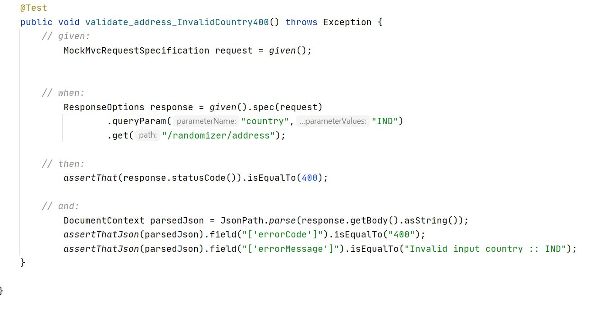

#Random Address Generator

## Requirements

As part of this code challenge, I need to implement a REST HTTP service that can generate a random address.

As a member of the test engineering team, I'm expected to implement the service following the technical specifications described below.

Note that the address does NOT have to be logically/shipping valid up to a country level. 
However, it is supposed to be in a human-readable country mailing format. As an example, “532 Union St., Apt 72, San Diego, NY, 789302” is acceptable even though this address won’t pass USPS validation.
In addition, limit the set of countries to 4:

- US
- Canada
- Mexico
- Netherlands

The response must be in a human-readable format such as JSON, XML, YAML, TOML, etc. The implementation should follow best development practices and should preferably be a Java + Spring Boot solution, but you may if needed, choose another object-oriented language that you are familiar with.

### Technical details:

#### Endpoint:
GET /randomizer/address

Return object definition:

| Field Name    | Data Type     | Description|
| :------------- | :------------- | :---------|
|house          |String         |House or street number.|
|street         |String         |Street name (in practice may also contain street number).|
|postalCode     |String         |An alphanumeric string included in a postal address to facilitate mail sorting (a.k.a. post code, postcode, or ZIP code).|
|City           |String         |The name of the primary locality of the place.|
|county         |String         |A division of a state; typically a secondary-level administrative division of a country or equivalent.|
|state          |String; optional|A division of a country; typically a first-level administrative division of a country and/or a geographical region.|
|stateCode      |String; optional|A code/abbreviation for the state division of a country.|
|country        |String; optional|The localised country name.|
|countryCode    |String (ISO 3166-1 alpha-3 code)|A three-letter country code.|

## Assumptions
1) API will take optional country parameter (query parameter) to retrieve specific country address. it is case insensitive ( eg. usa, USa, USA, uSA).
2) If country is not passed api picks a random country implementations and return respective address format.
3) Changing the field name City -> city to maintain consistency. 
4) house, street, postalCode, city, state, stateCode are generated randomly via faker api.
5) street will be having suite or apt no. with comma separated.
6) state vs stateCode are pulled from a static Map.
7) Though county field is mandatory. However, it's not available for all the countries(NLD,CAN,MEX) so populating city as county.
8) Optional fields (state, stateCode) will return null value. API will populate these fields as null when ThreadLocalRandom.current().nextBoolean() returns false.
9) Though country is optional, would always be populated from the enum Countries.

## Tools and Frameworks
- Spring Boot 2.3.2
- Lombok 1.18.12
- gradle 6.4.1
- spring cloud contract verifier - Hoxton.SR6
- javafaker 1.0.2
- swagger-ui 2.7.0

## Design

Introduced an optional query parameter country to take the input from the user. i.e String (ISO 3166-1 alpha-3 code)( Example: CAN, USA, MEX, NLD)

When country code not passed, then using ThreadLocalRandom.current().nextInt() a random country from the list of implemented classes would be selected and corresponding address is returned with HTTP statue code 200(OK).

When a wrong country code( not in the implemented list of countries) system will throw IllegalArgumentException which inturn be handled by the controllerAdvice class
and return HTTP status code of 400 (Bad request) with a readable error message.

if there are any errors from the application , it would return 500 ( internal server error)

#### Implementation Approach: 

Looking at the need to add more countries support in future, selected strategy design pattern.

With this pattern future extension is possible than modification.

Where all the service implementation classes would be responsible to return their corresponding country related address formats.

Depending on the passed country code, system will pick the corresponding algorithm / implementation for address generation.

Defined an interface Country.java and it is implemented by 4 countries USA.java , Canada.java, Mexico.java and Netherlands.java. all these service classes are annotated with @Service.

In future when more countries support is needed, the only change would be adding a new implementation class to generate corresponding address.

Below is the reference class diagram

CountriesFactory class creates a Map <String, Country> where key is country code ( ISO 3166-1 alpha-3 code) and value is corresponding country implementation bean. 

findCountry() returns an Optional<Country> if it's null it throws IllegalArgumentException.

enum Countries will maintain all country codes and country names as constants.

* java faker library:
    1) This library can be used to generate the address based on the region or language based.
    2) Used locales to make the generated data more specific to a single location. 
        Used Faker with  en-US , es-CA , es-MX and nl locale. 
    3) Mapping of state to state code is not working with faker api. so created a static Map which holds all the state codes vs state names of the countries.
       
     
* Spring Cloud Contract
    1) Chosen spring cloud contracts to enable TDD at architecture level.   
    2) Based on the contracts from the consumer( SDET test document) contracts are designed.
        1) address.groovy
        2) address_invalidCountry400.groovy
        
        folder structure: placed under test/resources -> contracts
        
        
    3) Base test class AddressBase.java is to mock the factory calls and address generation method.
    4) AddressTest.java is auto generated by the spring cloud contract framework.
        
        Auto generated Test snippet :
        
        Test case 1:
        
        
        Test case 2:
        
    5) After build is successful it generates stubs.jar under library folder which can be used by WireMock when doing integration testing on the client code (client tests).

* Swagger UI 2.0 
    1) swagger ui is used to expose api documentation.
    2) used swagger to test the api manually using try out option.

## API specification (Swagger)
Swagger 2.0 is enabled and api specifications can be found in below location after once service is running.
    
    http://localhost:8080/swagger-ui.html

## How to Run

to clean build ( runs test task as well) 
~~~
gradle clean build
~~~
~~~
Task :clean
Task :compileJava
Task :compileGroovy NO-SOURCE
Task :processResources
Task :classes
Task :bootJar
Task :jar SKIPPED
Task :copyContracts
Task :generateClientStubs
Task :verifierStubsJar
Task :assemble
Task :generateContractTests
Task :compileTestJava
Task :compileTestGroovy NO-SOURCE
Task :processTestResources
Task :testClasses
Task :test
Task :check
Task :build

BUILD SUCCESSFUL in 28s
11 actionable tasks: 11 executed
~~~
NOTE: generateContractTests task will generate AddressTest.java from given contracts.
Included build folder as well in the repository just in case to take a look at AddressTest.java under generated-test-sources.

Execute the below command to run the application 

~~~ 
gradle bootRun 
~~~
~~~
  .   ____          _            __ _ _
 /\\ / ___'_ __ _ _(_)_ __  __ _ \ \ \ \
( ( )\___ | '_ | '_| | '_ \/ _` | \ \ \ \
 \\/  ___)| |_)| | | | | || (_| |  ) ) ) )
  '  |____| .__|_| |_|_| |_\__, | / / / /
 =========|_|==============|___/=/_/_/_/
 :: Spring Boot ::        (v2.3.2.RELEASE)

INFO 5836 --- [           main] com.random.address.AddressApplication    : Started AddressApplication in 3.814 seconds (JVM running for 4.291)

~~~

to stop the application use ctrl + c as below

~~~
<==========---> 80% EXECUTING [17m 14s]                                                                                 > :bootRun
Terminate batch job (Y/N)? Y
~~~

Swagger UI :

Try it Out ! screenshots

* Case 1: Random address without query parameter country.

* Case 2: with country=CAN

with state as null

with state and stateCode

with state and stateCode as null

with stateCode as null

Note: same with other countries implementations and tested.

* Case 3: with country=MEX

 

* Case 4: with country=NLD

* Case 5: with country=USA

* Case 6: with country=IND (selecting country code not implemented yet or a wrong code.)

### Enhancements in 0.0.2-SNAPSHOT

1) Improved junit coverage to 100% line coverage on service classes.
2) Added new Util class RandomBoolean.java used by all the Country implementations to get random boolean value to populate optional fields.
    Wrapped static method call(LocalThreadRandom.current) in an instance method getNextBoolean() to unitTest easily.
    
